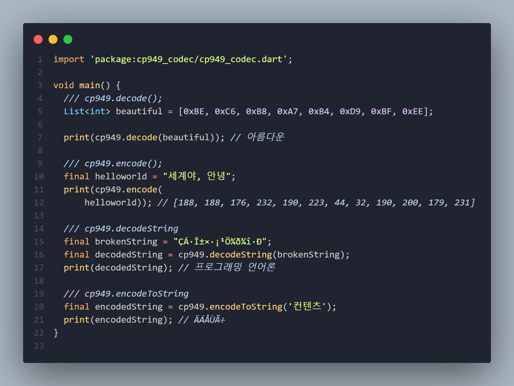

# cp949_codec

**null-safety** cp949 decoder/encoder

---



## 다른 플러그인보다 좋은 점

### 1. 메모리 소모를 줄였습니다

> 다트의 `int` 는 8바이트 자료형입니다. cp949는 2바이트만 있으면 되기 때문에, `BytesBuilder` 를 이용해서 **메모리 소모를 줄였습니다.** host endian이 Little Endian인 경우에만 제대로 동작합니다.

### 2. **example** 과 **test** 가 포함되어 있는 유일한 cp949 패키지 입니다

### 3. 다트 표준 라이브러리에서 사용하는 `Encoding` 프로토콜을 따르고 있습니다

> dart:convert 에 있는 `latin1`, `utf8` 등에 쓰이는 `Encoding` 프로토콜을 사용합니다. `Encoder`와 `Decoder`는 `Converter`를 사용합니다.

### 4. pub score 가 제일 높습니다

---

## 사용법 (Usage)

### 준비

다음 명령어를 사용해서 패키지 의존성을 추가합니다.

```bash
flutter pub add cp949_codec
```

import 를 합니다.

```dart
import 'package:cp949_codec/cp949_codec.dart';
```

### cp949.decode

`List<int>` 로 된 cp949 문자열을 다트 `String` 으로 바꿔줍니다.

```dart
/// cp949.decode();
List<int> beautiful = [0xBE, 0xC6, 0xB8, 0xA7, 0xB4, 0xD9, 0xBF, 0xEE];

print(cp949.decode(beautiful)); // 아름다운
```

### cp949.encode

반대로 `String` 을 `List<int>` 형태로 바꿔줍니다.

```dart
/// cp949.encode();
final helloworld = "세계야, 안녕";
print(cp949.encode(
    helloworld)); // [188, 188, 176, 232, 190, 223, 44, 32, 190, 200, 179, 231]
```

### cp949.decodeString

다트의 Unicode 코덱으로 잘못 디코딩된 cp949 String을 제대로 보이도록 디코딩 해줍니다.

```dart
/// cp949.decodeString
final brokenString = "ÇÁ·Î±×·¡¹Ö¾ð¾î·Ð";
final decodedString = cp949.decodeString(brokenString);
print(decodedString); // 프로그래밍 언어론
```

### cp949.encodeToString

문자열을 cp949 코덱으로 인코딩 한 바이트 배열을 다트의 Unicode 코덱으로 디코딩한 결과 문자열을 보여줍니다.

```dart
/// cp949.encodeToString
final encodedString = cp949.encodeToString('컨텐츠');
print(encodedString); // ÄÁÅÙÃ÷
```

[Example](https://pub.dev/packages/cp949_codec/example)

기존 [cp949](https://github.com/jjangga0214/dart-cp949) 플러그인의 사용법을 그대로 사용할 수 있습니다.

euc-kr 로 인코딩된 문자열을 해독할 때도 이 플러그인을 사용할 수 있습니다.

---

## PR과 이슈는 언제든지 환영합니다

❤️[PR](https://github.com/letyletylety/cp949_codec/pulls)

🤔[issue](https://github.com/letyletylety/cp949_codec/issues)
